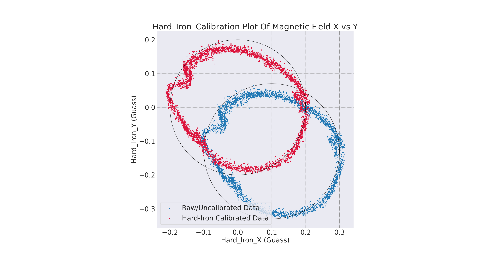
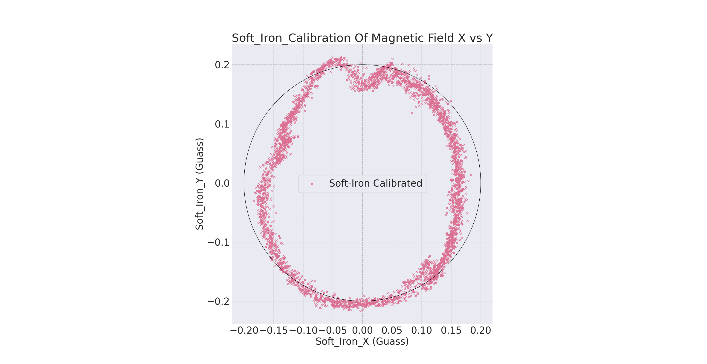

# 1. Magnetometer Hard and Soft Iron Calibration
A magnetometer is a sensor used to measure the strength and direction of the local magnetic field surrounding a system. This magnetic field measurement can then be compared to models of Earth’s magnetic field to determine the heading of a system with respect to magnetic North. However, in most real-world applications, the magnetic field measured will be a combinationof both Earth’s magnetic field as well as magnetic fields created by nearby objects, commonly referred to as magnetic disturbances. In order to obtain an accurate heading estimate, the impact of nearby magnetic disturbances must be mitigated. Internal magnetic disturbances that are non-time varying can be accounted for using a hard and soft iron (HSI) calibration.

# 1.1 Hard and Soft Iron Distortions
Magnetic measurements are subjected to distortion. These distortions are considered to fall in one of two categories:
1. Hard iron distortions: They are created by objects that produce a magnetic field. A speaker or piece of magnetized iron for example will cause a hard iron distortion. If the piece of magnetic material is physically attached to the same reference frame as the sensor, then this type of hard iron distortion will cause a permanent bias in the sensor output.

2. Soft iron distortions: They are considered deflections or alterations in the existing magnetic field. These distortions will stretch or distort the magnetic field depending upon which direction the field acts relative to the sensor. This type of distortion is commonly caused by metals such as nickel and iron. In most cases hard iron distortions will have a much larger contribution to the total uncorrected error than soft iron.

# 1.2 Visualizing Hard and Soft Iron Distortions
1. Case 1- No Distortions: In the event that there are no hard or soft iron distortions present, the measurements should form a circle centered at X=0, Y=0. The radius of the circle equals the magnitude of the magnetic field.
2. Case 2 - Hard Iron Distortions: Hard iron distortions will cause a permanent bias to be present in the magnetic measurements, which leads to a shift in the center of the circle. Suppose X=200 and Y=100, from this it can be concluded that there is 200 mGauss hard iron bias in the X-axis and 100 mGauss hard iron bias in the Y-axis.
3. Case 3 - Hard and Soft Iron Distortions: Hard iron distortions will only shift the center of the circle away from the origin, they will not distort the shape of the circle in any way. Soft iron distortions, on the other hand, distort and warp the existing magnetic fields. When plotting the magnetic output, soft iron distortions are easy to recognize as they will distort the circular output into an elliptical shape. Every ellipse has a major and minor axis if the major and minor axis aligned to some degrees from the body frame then it is caused by the soft iron distortions.

# 1.3 Hard-Iron Calibration
Compensating for hard-iron distortion is accomplished by determining the x and y offsets and then applying these constants directly to the data.

```
					where,  α is X axis offset
						β is Y axis offset
α = (Xmax + Xmin)/2				Xmax is Maximum X value
β = (Ymax + Ymin)/2				Xmin is Minimum X value
						Y max is Maximum Y value
						Y min is Minimum Y value
These offsets are then subtracted from the raw x and y magnetometer data, thus largely eliminating the hard-iron distortion. 
```
# 1.4 Soft-Iron Calibration
After hard-iron calibration, the origin of the ellipse is at (0, 0), and is exhibiting a rotation of θ degrees from the X axis.

```
r = \sqrt{X1^2 + Y1^2}
θ = arcsin(Y 1/r)
                    
R = [ cosθ sinθ]      
    [−sinθ cosθ]
    
v1 = Rv
σ = q/r           
```
One method of identifying ”r” is to calculate the magnitude of each data point and then identify the maximum of these computed values. The coordinates of this value will correspond with the major axis. Similarly, the minimum value will correspond to the minor axis, ”q”. Once θ has been identified, the rotation matrix ”R” given is applied to the vector of magnetometer x and y values. After the rotation, the major axis of the ellipse will be aligned with the reference frame X axis and the minor axis will be aligned with the Y axis. Following the rotation, we can now properly scale the major axis such that the ellipse is converted to an approximate circle. The scale factor σ, is determined, and is the ratio of the length of the major axis to that of the minor axis. Each magnetometer x value is then divided by this scale factor to produce the desired circle.


